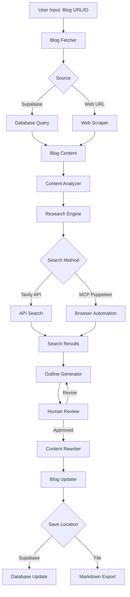

# Blog Improvement System Architecture

## Overview

The Blog Improvement System is a LangGraph-based workflow designed to automatically enhance existing 9takes personality blogs by researching new information, generating improved content, and updating the blogs while maintaining their original voice and structure.

## System Components

### 1. Data Flow Architecture



### 2. State Management

The system uses a `BlogUpdateState` dataclass to maintain workflow state:

```python
@dataclass
class BlogUpdateState:
    # Input
    blog_identifier: str  # URL or Supabase ID
    
    # Blog Content
    current_content: str
    current_markdown: str
    
    # Analysis
    person: str
    enneagram_type: str
    current_outline: str
    suggestions: str
    
    # Research
    search_queries: List[str]
    search_results: List[Dict]
    
    # Generation
    proposed_outline: str
    approved_outline: str
    rewritten_content: str
    
    # Metadata
    blog_metadata: Dict  # From Supabase
    workflow_status: str
```

### 3. Node Responsibilities

#### **fetch_blog_content**
- Determines if input is URL or Supabase ID
- Fetches from appropriate source
- Extracts and cleans content
- Preserves metadata for later use

#### **analyze_content**
- Extracts person name and Enneagram type
- Maps current blog structure
- Identifies content gaps
- Generates improvement suggestions

#### **generate_search_queries**
- Creates targeted research queries
- Focuses on recent developments
- Seeks specific examples and stories
- Avoids generic information

#### **search_web**
- Executes searches via configured method
- Aggregates and deduplicates results
- Filters for relevance and recency
- Formats for LLM consumption

#### **create_outline**
- Integrates new research findings
- Maintains original blog structure
- Highlights new sections/additions
- Preserves SEO optimization

#### **human_feedback**
- Presents proposed changes
- Accepts approval or revisions
- Supports iterative refinement
- Logs decisions for audit

#### **rewrite_blog**
- Generates enhanced content
- Maintains original voice/style
- Integrates new information seamlessly
- Preserves formatting and structure

#### **save_blog**
- Updates Supabase record
- Maintains version history
- Exports markdown if requested
- Triggers any post-update hooks

## Integration Points

### 1. Supabase Integration

```python
# Expected Supabase Schema
blogs_table = {
    "id": "uuid",
    "slug": "text",  # URL slug
    "title": "text",
    "content": "text",  # HTML content
    "markdown": "text",  # Markdown version
    "person": "text",
    "enneagram_type": "integer",
    "metadata": "jsonb",
    "updated_at": "timestamp",
    "version": "integer"
}
```

### 2. MCP Puppeteer Server

The MCP Puppeteer server provides advanced web scraping capabilities:

- **Dynamic Content**: Handles JavaScript-rendered pages
- **Authentication**: Can handle login-protected content
- **Screenshots**: Captures visual content for analysis
- **Interaction**: Can navigate and interact with web pages

Configuration:
```json
{
  "mcpServers": {
    "puppeteer": {
      "command": "npx",
      "args": ["-y", "@modelcontextprotocol/server-puppeteer"],
      "env": {}
    }
  }
}
```

### 3. Search APIs

#### Tavily API (Default)
- Fast, purpose-built for LLM research
- Good for general web search
- Rate limits apply

#### Perplexity API
- Advanced semantic search
- Better for technical queries
- Higher quality results

#### MCP Puppeteer (Advanced)
- Direct page scraping
- Handles dynamic content
- No API limits
- Slower performance

## Configuration

### Environment Variables

```bash
# Core LLM Providers
OPENAI_API_KEY=
ANTHROPIC_API_KEY=
GROQ_API_KEY=

# Search Providers
TAVILY_API_KEY=
PERPLEXITY_API_KEY=

# Database
SUPABASE_URL=
SUPABASE_ANON_KEY=
SUPABASE_SERVICE_KEY=  # For write operations

# Optional
MCP_PUPPETEER_ENABLED=false
LANGCHAIN_API_KEY=  # For tracing
```

### Runtime Configuration

```python
config = {
    "search_method": "tavily",  # tavily, perplexity, mcp_puppeteer
    "writer_model": "claude-3-5-sonnet-latest",
    "planner_model": "gpt-4",
    "max_search_queries": 5,
    "search_depth": 2,  # Iterations of search refinement
    "preserve_style": True,
    "require_approval": True,
    "save_to_supabase": True,
    "export_markdown": True
}
```

## Security Considerations

1. **API Key Management**
   - Never commit keys to repository
   - Use environment variables
   - Rotate keys regularly

2. **Supabase RLS**
   - Use Row Level Security
   - Separate read/write keys
   - Audit log all changes

3. **Content Validation**
   - Sanitize HTML content
   - Validate person/type extraction
   - Check for malicious injections

4. **Rate Limiting**
   - Implement backoff strategies
   - Queue management for bulk updates
   - Monitor API usage

## Performance Optimization

1. **Caching Strategy**
   - Cache search results (15 min TTL)
   - Store analyzed outlines
   - Reuse LLM embeddings

2. **Parallel Processing**
   - Concurrent search queries
   - Batch blog fetching
   - Async I/O operations

3. **Resource Management**
   - Stream large content
   - Chunk processing for long blogs
   - Memory-efficient state handling

## Monitoring & Logging

1. **Workflow Tracking**
   - LangSmith integration for traces
   - State transitions logging
   - Performance metrics

2. **Error Handling**
   - Graceful API failures
   - Retry mechanisms
   - Fallback strategies

3. **Audit Trail**
   - Version history in Supabase
   - Change attribution
   - Rollback capability

## Future Enhancements

1. **Batch Processing**
   - Update multiple blogs in parallel
   - Scheduled updates for all blogs
   - Bulk approval interface

2. **Quality Assurance**
   - Automated fact-checking
   - Style consistency validation
   - SEO impact analysis

3. **Advanced Research**
   - Social media integration
   - Academic paper search
   - Video content analysis

4. **Personalization**
   - Learn from approval patterns
   - Adapt to writing style preferences
   - Custom research sources per topic